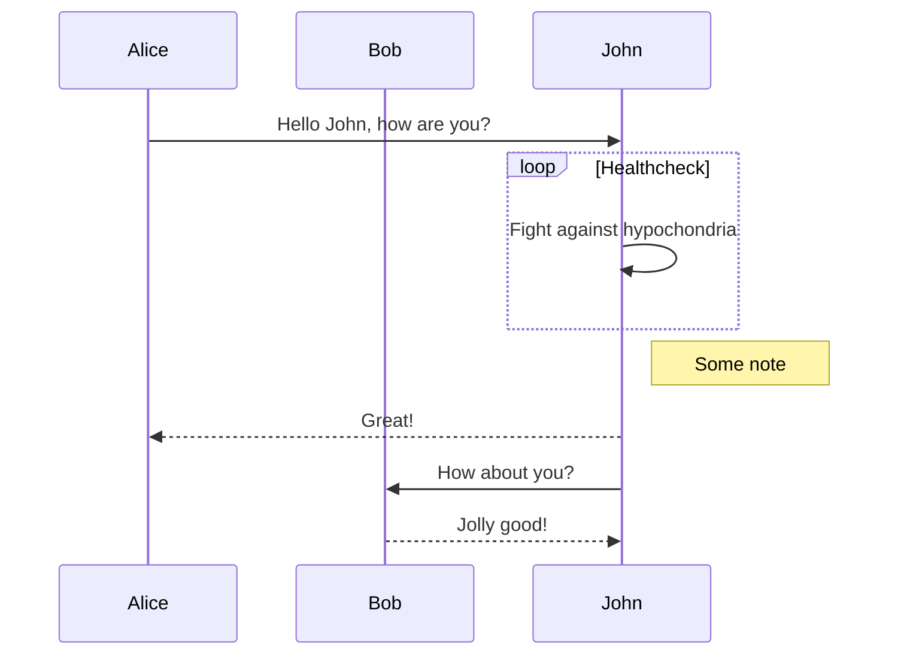
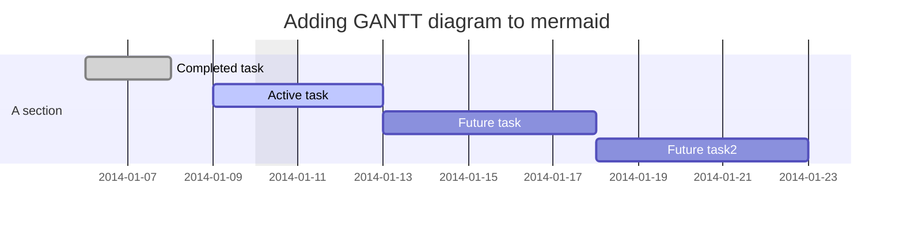
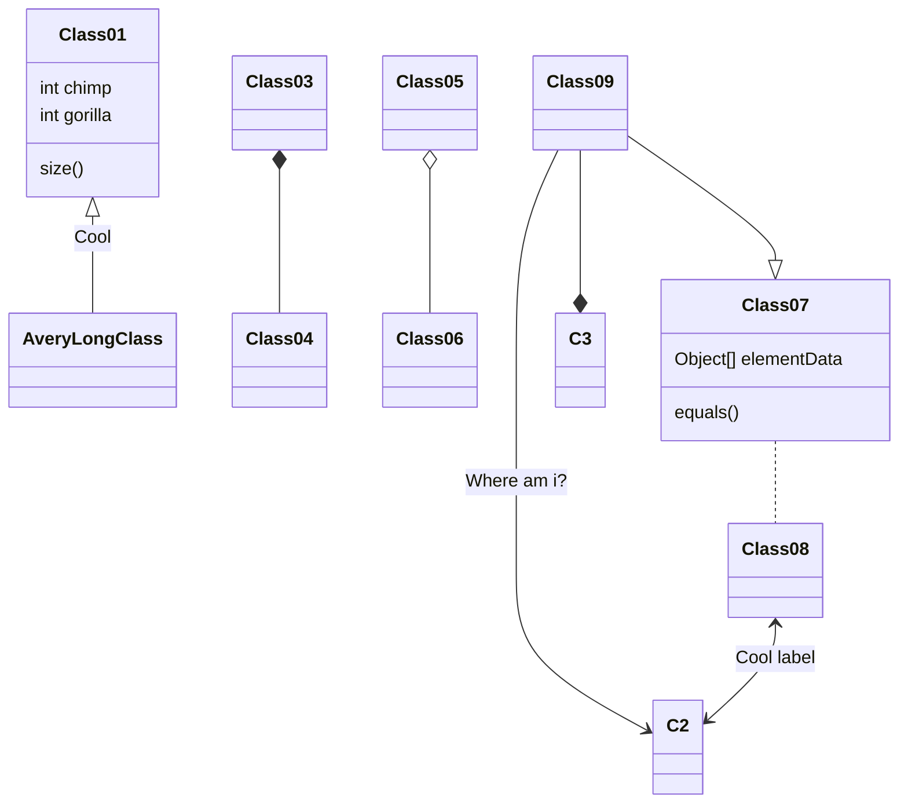

# Diagram and Formulas

## Math Formulas

### Inline Math Formulas

Wrap one line LaTeX with a single dollar sign: <code>$</code>.

```markdown
For example, to show $\alpha \beta \gamma$ inline with other text, just wrap it in dollar signs.
```

### Block Math Formulas

Two consecutive dollar signs are used to denote multiple lines of math formulas: <code>$$</code>.

For example, this:

$$
R_x=\begin{pmatrix}
1 & 0 & 0 & 0\\
0 & cos(a) & -sin(a) & 0\\
0 & sin(a) & cos(a) & 0\\
0 & 0 & 0 & 1
\end{pmatrix}
$$

or

$$
m=\frac{b_y-a_y}{b_x-a_x}
$$

<br/>

## Diagrams

MarkText support class, flow chart, gantt and sequence diagrams powered by flowchart.js, mermaid and Vega-Lite. [Code](#code) blocks with special language identifiers are used for diagrams.

For example, this:

## Vega-lite diagram

Please see [introduction to Vega-Lite](https://vega.github.io/vega-lite/tutorials/getting_started.html) for details.

```vega-lite
{
  "data": {
    "values": [
      {"a": "C", "b": 2}, {"a": "C", "b": 7}, {"a": "C", "b": 4},
      {"a": "D", "b": 1}, {"a": "D", "b": 2}, {"a": "D", "b": 6},
      {"a": "E", "b": 8}, {"a": "E", "b": 4}, {"a": "E", "b": 7}
    ]
  },
  "mark": "point",
  "encoding": {
    "x": {"field": "a", "type": "nominal"},
    "y": {"field": "b", "type": "quantitative"}
  }
}
```

## Flowchart

```flowchart
st=>start: Start|past
e=>end: End|future
op1=>operation: My Operation|past
op2=>operation: Stuff|current
sub1=>subroutine: My Subroutine|invalid
cond=>condition: Yes
or No?|approved:>http://www.google.com
c2=>condition: Good idea|rejected
io=>inputoutput: catch something...|future

st->op1(right)->cond
cond(yes, right)->c2
cond(no)->sub1(left)->op1
c2(yes)->io->e
c2(no)->op2->e
```

## Sequence diagram

```sequence
Title: Here is a title
A->B: Normal line
B-->C: Dashed line
C->>D: Open arrow
D-->>A: Dashed open arrow
```

## Flowchart


## Sequence diagram



## Gantt diagram



<br/>

## Class diagram (experimental)


